# Mobile Service Management App

Aplicación móvil desarrollada para optimizar el registro de servicios de instalación, revisión, desinstalación y reposición de dispositivos de prevención de accidentes en vehículos de transporte.

Este sistema permite a los técnicos registrar servicios directamente desde campo mediante una aplicación móvil conectada a un backend mediante APIs REST y una base de datos centralizada.

---

# Tecnologías utilizadas

## Frontend
- React Native
- JavaScript

## Backend
- Node.js
- NestJS
- REST API

## Base de datos
- PostgreSQL

## Herramientas
- Git
- Postman
- pgAdmin
- Figma

---

# Arquitectura del sistema

El sistema sigue una arquitectura cliente-servidor donde la aplicación móvil se comunica con el backend mediante APIs REST.

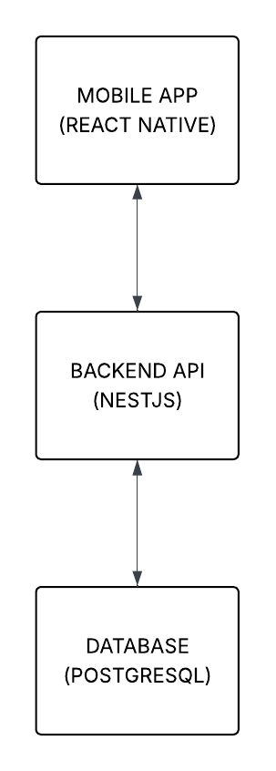

---

# Flujo de la aplicación

El flujo principal de uso del sistema es el siguiente:

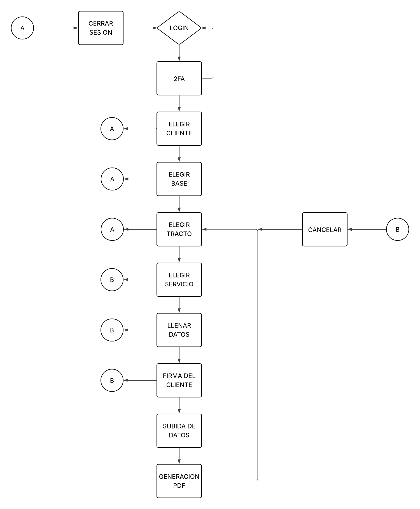

---

# Capturas del sistema

## Inicio de sesión
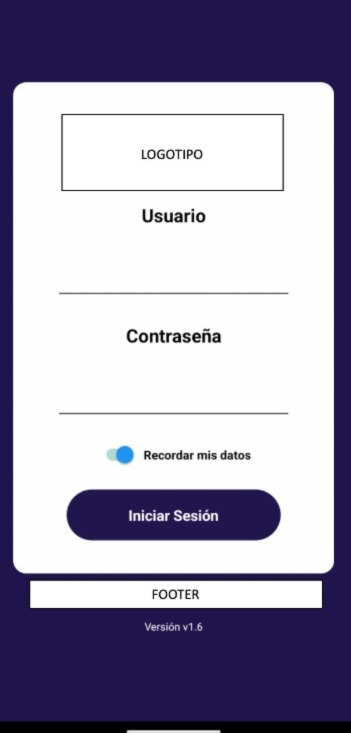

## Autenticación en dos pasos
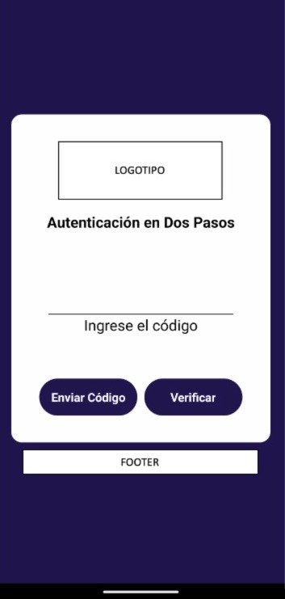

## Selección de cliente
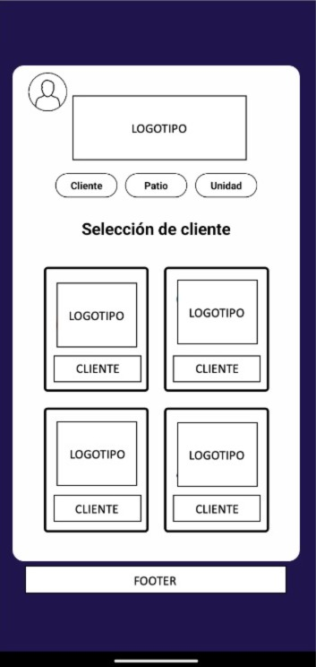

## Selección de servicio
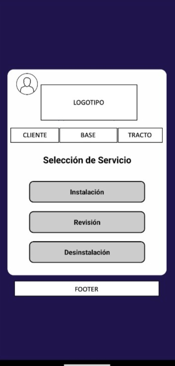

## Instalación de servicio
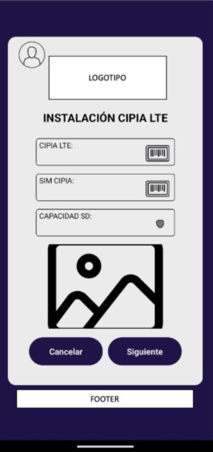

## Revisión de servicio
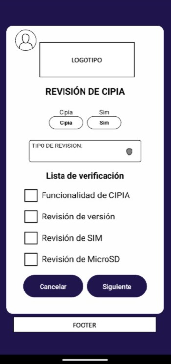

## Desinstalación de servicio
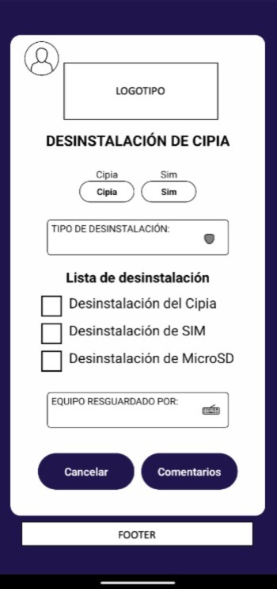

## Finalización del servicio
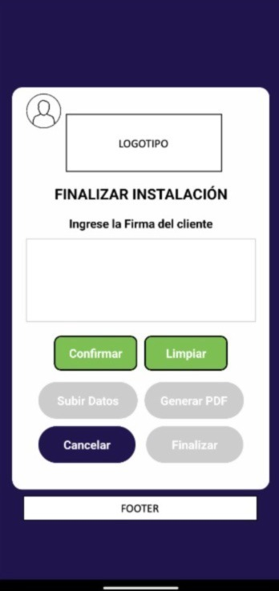

## Generación de reporte
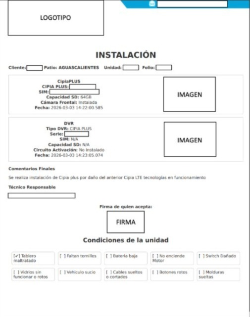

---

# Funcionalidades principales

- Autenticación de usuarios
- Autenticación en dos pasos (2FA)
- Selección de cliente y unidad
- Registro de servicios de instalación
- Registro de revisiones técnicas
- Registro de desinstalaciones
- Registro de reposiciones
- Historial de servicios
- Generación automática de reportes

---

# Rol en el proyecto

Durante el desarrollo del proyecto participé como **Desarrollador Full Stack Jr.** realizando las siguientes actividades:

- Desarrollo de la aplicación móvil con React Native
- Desarrollo del backend utilizando NestJS
- Implementación de APIs REST
- Integración entre frontend móvil y backend
- Diseño y optimización de consultas SQL en PostgreSQL
- Pruebas de endpoints utilizando Postman
- Uso de Git para control de versiones

---

# Nota

Este repositorio se publica únicamente con fines de **portafolio profesional**.

Los nombres de empresas, logos, datos y configuraciones internas han sido modificados o eliminados para evitar exponer información sensible.
